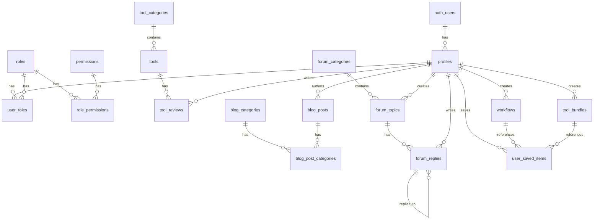

# Database Setup & Documentation

## 1. Overview

### System Architecture

The database is built on PostgreSQL with Supabase, implementing a modular design with five core systems:
- Authentication & User Management
- Tools Directory
- Blog System
- Community/Forum
- Workflows & Bundles

### Entity Relationship Diagram



### Key Design Principles

1. **Security-First Design**
   - Row Level Security (RLS) enabled on all tables
   - Role-based access control
   - Fine-grained permissions system

2. **Performance Optimization**
   - Strategic indexing for common queries
   - Optimized table structures
   - Efficient relationship management

3. **Data Integrity**
   - Foreign key constraints
   - Check constraints for data validation
   - Automated timestamp management

## 2. Database Systems

### Authentication & User Management

```sql
-- Core tables
profiles (id, username, full_name, avatar_url)
roles (id, name, description)
permissions (id, name, description)
user_roles (user_id, role_id)
role_permissions (role_id, permission_id)
```

Key features:
- Profile management with avatar support
- Hierarchical role-based access control
- Granular permission system

### Tools Directory

```sql
-- Core tables
tool_categories (id, name, slug, description)
tools (id, name, slug, description, category_id, features)
tool_reviews (id, tool_id, user_id, rating, review_text)
```

Features:
- Categorized tool management
- User reviews and ratings
- Feature-rich tool metadata storage

### Blog System

```sql
-- Core tables
blog_categories (id, name, slug, description)
blog_posts (id, title, slug, content, author_id, status)
blog_post_categories (post_id, category_id)
```

Features:
- Multi-category support for posts
- Draft/Published/Archived post states
- Rich content management

### Community/Forum

```sql
-- Core tables
forum_categories (id, name, description, display_order)
forum_topics (id, category_id, author_id, title, content)
forum_replies (id, topic_id, author_id, parent_reply_id)
```

Features:
- Nested reply support
- Topic pinning and locking
- View count tracking

### Workflows & Bundles

```sql
-- Core tables
workflows (id, creator_id, title, description, is_public)
tool_bundles (id, creator_id, title, tools, is_public)
user_saved_items (id, user_id, item_id, item_type)
```

Features:
- Public/private workflow sharing
- Tool bundling support
- Save/bookmark functionality

## 3. Security

### Row Level Security (RLS) Policies

All tables implement RLS with these common patterns:
- Public read access for published content
- Creator-only write access
- Admin override capabilities

Example policies:
```sql
-- Example for blog posts
CREATE POLICY "Public can read published posts"
    ON blog_posts FOR SELECT
    USING (status = 'published');

CREATE POLICY "Authors can manage their own posts"
    ON blog_posts FOR ALL
    USING (auth.uid() = author_id);
```

### Role-Based Access Control

1. Default Roles:
   - Admin: Full system access
   - User: Standard access
   
2. Custom Permissions:
   - Resource-specific (create, read, update, delete)
   - System-wide operations

### User Permissions

Permission inheritance flow:
1. User → Roles
2. Roles → Permissions
3. Permissions → Operations

## 4. Performance

### Indexes & Optimizations

Common indexes:
```sql
-- Foreign key indexes
CREATE INDEX idx_tools_category ON tools(category_id);
CREATE INDEX idx_tool_reviews_tool ON tool_reviews(tool_id);

-- Search optimization
CREATE INDEX idx_tools_search ON tools USING GIN (to_tsvector('english', name || ' ' || description));

-- Status filtering
CREATE INDEX idx_blog_posts_status ON blog_posts(status);
```

### Query Best Practices

1. Use appropriate indexes:
   ```sql
   -- Good: Uses index
   SELECT * FROM tools WHERE category_id = $1;
   
   -- Bad: Full table scan
   SELECT * FROM tools WHERE description LIKE $1;
   ```

2. Join optimization:
   - Use appropriate join types (INNER, LEFT, etc.)
   - Consider materialized views for complex queries

### Performance Monitoring

Key metrics to monitor:
- Query execution time
- Index usage statistics
- Table bloat
- Cache hit ratios

## 5. Setup & Maintenance

### Initial Setup

1. Create database:
   ```bash
   createdb yourdbname
   ```

2. Run migrations:
   ```bash
   supabase db reset
   ```

### Migration Process

Migrations are stored in `supabase/migrations/` and follow this naming pattern:
```
YYYYMMDD_description.sql
```

To add a new migration:
1. Create new file in migrations directory
2. Add UP and DOWN migrations
3. Run migration using Supabase CLI

### Backup & Recovery

1. Regular backups:
   ```bash
   pg_dump dbname > backup.sql
   ```

2. Point-in-time recovery enabled

### Common Operations

1. Reset user password
2. Modify user roles
3. Content moderation
4. Data exports

## 6. TypeScript Integration

### Types & Interfaces

```typescript
// Table definitions
interface Profile {
  id: string;
  username: string;
  full_name: string | null;
  avatar_url: string | null;
}

interface Tool {
  id: string;
  name: string;
  description: string | null;
  category_id: string;
  features: Record<string, any>;
}
```

### Database Access Patterns

```typescript
// Example database access
async function getToolsByCategory(categoryId: string): Promise<Tool[]> {
  const { data, error } = await supabase
    .from('tools')
    .select('*')
    .eq('category_id', categoryId);
    
  if (error) throw error;
  return data;
}
```

### Type Safety

1. Generated types from database schema
2. Runtime type checking
3. Validation middleware

For detailed TypeScript usage examples and patterns, refer to the `src/database/` directory.