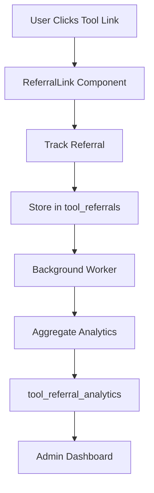

# Referral System Implementation Plan

This document outlines the implementation plan for the website referral system that tracks user navigation to different tools and provides analytics capabilities.

## Table of Contents
- [Database Schema Updates](#database-schema-updates)
- [Frontend Implementation](#frontend-implementation)
- [Backend Implementation](#backend-implementation)
- [Security & Privacy](#security--privacy)
- [Integration Points](#integration-points)
- [Migration Plan](#migration-plan)
- [Testing Strategy](#testing-strategy)

## System Architecture Flow



## Database Schema Updates

We will add new tables to the existing Supabase database to track referrals and store analytics data:

```sql
-- Track tool referral clicks
tool_referrals (
    id: uuid primary key,
    tool_id: uuid references tools(id),
    user_id: uuid references auth.users(id) nullable,
    referral_source: text,
    clicked_at: timestamp with time zone,
    ip_address: inet,
    user_agent: text,
    session_id: text
)

-- Aggregate analytics
tool_referral_analytics (
    id: uuid primary key,
    tool_id: uuid references tools(id),
    total_clicks: integer,
    unique_clicks: integer,
    time_period: text, -- 'daily', 'weekly', 'monthly'
    period_start: timestamp with time zone,
    period_end: timestamp with time zone
)
```

## Frontend Implementation

### Tool Card/Link Component Updates

1. Create a `ReferralLink` component that wraps tool links
   - Intercept click events
   - Track referral data
   - Handle navigation

2. Implement `useTrackReferral` hook
   - Manage referral tracking state
   - Handle API calls
   - Error handling and retry logic

3. Update existing tool cards to use the new referral link wrapper
   - Maintain existing functionality
   - Add referral tracking capability

### Analytics Dashboard

1. Add "Referral Analytics" section to admin Analytics page
   - Integration with existing admin layout
   - Role-based access control

2. Create visualization components:
   - Click trends over time chart
   - Tool referral leaderboard
   - Source attribution breakdown
   - Geographic distribution of clicks

3. Implement filtering and date range selection
   - Time period selection
   - Tool-specific filtering
   - Source filtering
   - Export capabilities

## Backend Implementation

### API Endpoints

New Supabase RPC functions to be implemented:

```typescript
trackToolReferral(toolId: string, referralData: ReferralData)
getReferralAnalytics(filters: AnalyticsFilters)
getToolReferralStats(toolId: string, timeRange: TimeRange)
```

### Analytics Processing

1. Background Worker Implementation
   - Process raw referral data
   - Calculate aggregates
   - Handle data cleanup

2. Data Aggregation Logic
   - Daily rollups
   - Weekly summaries
   - Monthly reports
   - Real-time stats

3. Scheduled Jobs
   - Analytics updates
   - Data cleanup
   - Report generation

## Security & Privacy

1. Rate Limiting Implementation
   - Per-IP limits
   - Per-session limits
   - Abuse prevention

2. Row Level Security (RLS) Policies
```sql
-- Example RLS policies
CREATE POLICY "Public can track referrals"
    ON tool_referrals FOR INSERT
    WITH CHECK (true);

CREATE POLICY "Only admins can view referral data"
    ON tool_referrals FOR SELECT
    USING (auth.uid() IN (
        SELECT user_id FROM user_roles WHERE role = 'admin'
    ));
```

3. GDPR Compliance
   - Data collection consent
   - Data anonymization
   - Data export capabilities
   - Right to be forgotten implementation

4. Data Retention
   - Raw data: 90 days
   - Aggregated data: 2 years
   - Automated cleanup processes

## Integration Points

1. Tool Interface Updates
```typescript
interface Tool {
    // ... existing fields ...
    referral_stats: {
        total_clicks: number;
        unique_clicks: number;
        recent_trend: number;
    };
}
```

2. Permission System Integration
```sql
-- New permission for referral analytics
INSERT INTO permissions (name, description)
VALUES ('view_referral_analytics', 'Can view tool referral analytics');
```

## Migration Plan

1. Database Migrations
   - Create new tables with versioned migrations
   - Add performance indexes
   - Configure RLS policies

```sql
-- Example migration
CREATE INDEX idx_tool_referrals_tool_id 
    ON tool_referrals(tool_id);

CREATE INDEX idx_tool_referrals_clicked_at 
    ON tool_referrals(clicked_at);
```

2. Backend Deployment
   - Deploy database changes
   - Set up background workers
   - Configure scheduled jobs

3. Frontend Deployment
   - Deploy component updates
   - Enable analytics dashboard
   - Roll out referral tracking

4. Data Backfill
   - Historical data migration
   - Analytics recalculation
   - Validation and verification

## Testing Strategy

### Unit Tests

1. Referral Tracking Functions
```typescript
describe('ReferralTracking', () => {
  it('should track new referral click', async () => {
    // Test implementation
  });
  
  it('should handle duplicate clicks', async () => {
    // Test implementation
  });
});
```

2. Analytics Calculations
   - Aggregation logic
   - Time period calculations
   - Statistical computations

3. Frontend Components
   - ReferralLink behavior
   - Analytics visualizations
   - Filter interactions

### Integration Tests

1. API Endpoints
   - Request/response validation
   - Error handling
   - Rate limiting

2. Analytics Aggregation
   - Data processing flow
   - Scheduled job execution
   - Data consistency

3. Admin Dashboard
   - Data loading and display
   - Filter functionality
   - Export capabilities

### End-to-End Testing

1. Click Tracking Flow
   - User click simulation
   - Data capture verification
   - Navigation behavior

2. Analytics Reporting
   - Dashboard loading
   - Real-time updates
   - Report generation

## Implementation Timeline

1. Phase 1: Database & Backend (Week 1)
   - Schema updates
   - API implementation
   - Initial testing

2. Phase 2: Frontend Components (Week 2)
   - ReferralLink development
   - Basic tracking implementation
   - Component integration

3. Phase 3: Analytics Dashboard (Week 3)
   - Dashboard development
   - Visualization implementation
   - Admin interface integration

4. Phase 4: Testing & Deployment (Week 4)
   - Comprehensive testing
   - Performance optimization
   - Production deployment

## Monitoring & Maintenance

1. Performance Metrics
   - Response times
   - Error rates
   - Database query performance

2. Analytics Accuracy
   - Data validation
   - Anomaly detection
   - Reporting accuracy

3. Regular Maintenance
   - Data cleanup
   - Index optimization
   - Cache management
