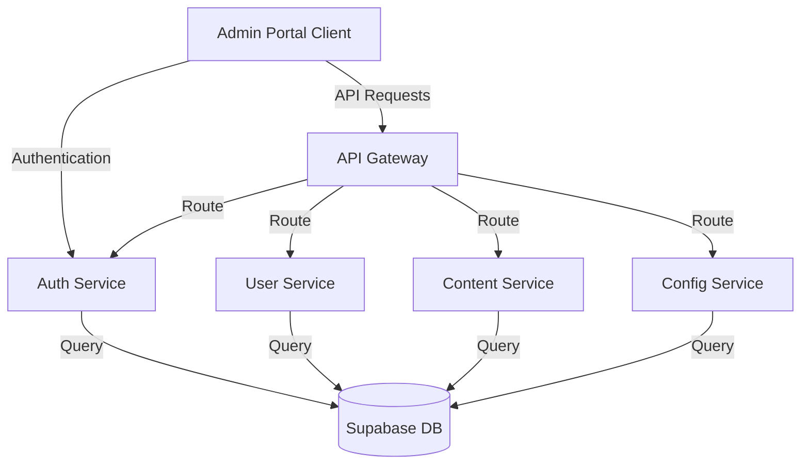
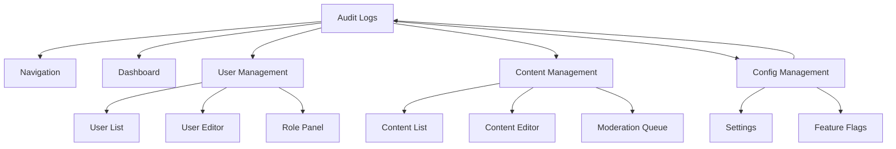

# Admin Portal Architecture

## 1. System Overview



## 2. Core Features

### User Management
- View and search users
- Edit user profiles
- Manage roles and permissions
- User activity monitoring

### Content Moderation
- Review and moderate content
- Content approval workflows
- Content categorization
- Version history

### System Configuration
- Feature flags management
- System settings
- Email template configuration
- Integration settings

### Access Control
- Role-based access control (RBAC)
- Permission management
- Access audit logging

## 3. Database Schema

### Content Management Tables
```sql
-- Content items table
create table public.content_items (
    id uuid primary key default gen_random_uuid(),
    title text not null,
    content text,
    status text not null default 'draft',
    type text not null,
    metadata jsonb,
    created_by uuid references auth.users(id),
    created_at timestamptz default now(),
    updated_at timestamptz default now(),
    published_at timestamptz,
    version integer default 1
);

-- Content version history
create table public.content_versions (
    id uuid primary key default gen_random_uuid(),
    content_id uuid references public.content_items(id),
    content text,
    metadata jsonb,
    created_by uuid references auth.users(id),
    created_at timestamptz default now(),
    version integer not null
);

-- Content moderation
create table public.moderation_queue (
    id uuid primary key default gen_random_uuid(),
    content_id uuid references public.content_items(id),
    status text not null default 'pending',
    moderator_id uuid references auth.users(id),
    moderated_at timestamptz,
    notes text,
    created_at timestamptz default now()
);
```

### Analytics Tables
```sql
-- User activity logs
create table public.activity_logs (
    id uuid primary key default gen_random_uuid(),
    user_id uuid references auth.users(id),
    action text not null,
    resource_type text not null,
    resource_id uuid,
    metadata jsonb,
    created_at timestamptz default now()
);

-- System metrics
create table public.system_metrics (
    id uuid primary key default gen_random_uuid(),
    metric_name text not null,
    metric_value numeric not null,
    dimensions jsonb,
    recorded_at timestamptz default now()
);
```

### Configuration Tables
```sql
-- System settings
create table public.system_settings (
    id uuid primary key default gen_random_uuid(),
    key text unique not null,
    value jsonb not null,
    description text,
    updated_by uuid references auth.users(id),
    updated_at timestamptz default now()
);

-- Feature flags
create table public.feature_flags (
    id uuid primary key default gen_random_uuid(),
    name text unique not null,
    description text,
    enabled boolean default false,
    conditions jsonb,
    created_at timestamptz default now(),
    updated_at timestamptz default now()
);
```

## 4. API Structure

### REST API Endpoints

```typescript
// User Management
GET    /api/users
GET    /api/users/:id
PUT    /api/users/:id
DELETE /api/users/:id
GET    /api/users/:id/activity

// Role Management
GET    /api/roles
POST   /api/roles
PUT    /api/roles/:id
DELETE /api/roles/:id
PUT    /api/users/:id/roles

// Content Management
GET    /api/content
POST   /api/content
PUT    /api/content/:id
DELETE /api/content/:id
GET    /api/content/:id/versions
POST   /api/content/:id/publish
POST   /api/content/:id/unpublish

// Moderation
GET    /api/moderation/queue
POST   /api/moderation/review/:id
GET    /api/moderation/history

// System Configuration
GET    /api/config/settings
PUT    /api/config/settings
GET    /api/config/features
PUT    /api/config/features/:id
```

## 5. Component Architecture

### Frontend Components



## 6. Security Implementation

### Authentication Flow
1. Admin users login through Supabase Auth
2. JWT token stored securely in memory
3. Token refresh handled automatically
4. Session timeout after inactivity

### Authorization
1. Role-based access control using existing roles system
2. Permission checks at API Gateway level
3. Row Level Security in database
4. Action audit logging

### Security Headers
```typescript
// API Gateway security headers
const securityHeaders = {
    'Content-Security-Policy': "default-src 'self'",
    'Strict-Transport-Security': 'max-age=31536000',
    'X-Frame-Options': 'DENY',
    'X-Content-Type-Options': 'nosniff',
    'Referrer-Policy': 'strict-origin-when-cross-origin',
    'Permissions-Policy': 'microphone=(), camera=()'
};
```

## 7. Error Handling

### Error Response Structure
```typescript
interface ErrorResponse {
    error: {
        code: string;
        message: string;
        details?: any;
        requestId?: string;
    };
    status: number;
}
```

### Error Categories
1. Authentication Errors (401)
2. Authorization Errors (403)
3. Validation Errors (400)
4. Resource Errors (404)
5. Server Errors (500)

## 8. State Management

### Admin Portal State
```typescript
interface AdminState {
    // Current admin user
    user: {
        id: string;
        roles: string[];
        permissions: string[];
    };
    
    // UI State
    ui: {
        currentSection: string;
        sidebarOpen: boolean;
        modals: {
            [key: string]: boolean;
        };
    };
    
    // Cache
    cache: {
        users: Map<string, User>;
        content: Map<string, ContentItem>;
        settings: SystemSettings;
    };
}
```

## 9. Implementation Plan

### Phase 1: Core Infrastructure (Week 1)
- Set up project structure
- Implement authentication integration
- Create base API routes
- Set up database schema

### Phase 2: User Management (Week 2)
- Implement user listing and search
- Build role management interface
- Create user activity monitoring
- Set up audit logging

### Phase 3: Content Management (Week 3)
- Build content moderation queue
- Implement content version control
- Create content editing interface
- Set up content workflows

### Phase 4: System Configuration (Week 4)
- Implement settings management
- Create feature flag system
- Build system metrics dashboard
- Add email template management

## 10. Performance Considerations

### Optimization Strategies
1. Implement caching for frequently accessed data
2. Use pagination for large data sets
3. Optimize database queries with proper indexes
4. Implement request debouncing and throttling
5. Use WebSocket for real-time updates

### Monitoring
1. Track API response times
2. Monitor database performance
3. Track user activity patterns
4. Set up error tracking and reporting

## 11. Testing Strategy

### Unit Tests
- Component rendering
- State management
- Utility functions
- API integration

### Integration Tests
- User workflows
- Permission checks
- Data persistence
- API endpoints

### E2E Tests
- Critical admin workflows
- Security features
- Cross-browser compatibility