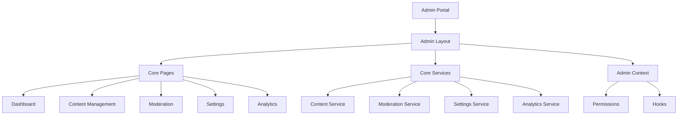

# Admin Portal Documentation

## Overview

The Admin Portal is a secure, feature-rich interface for managing the application's content, users, settings, and analytics. It provides role-based access control and a modular architecture for easy extension.

## Architecture

### Core Components



### Database Schema

The Admin Portal uses the following database tables:

- `content_items`: Stores all content with versioning
- `content_versions`: Tracks content history
- `moderation_queue`: Manages content review process
- `activity_logs`: Records user actions
- `system_metrics`: Stores performance metrics
- `system_settings`: Manages application configuration
- `feature_flags`: Controls feature availability

### Authentication & Authorization

- Built on top of Supabase Auth
- Role-based access control (RBAC)
- Permission-based feature access
- Row Level Security (RLS) policies

## Features

### Content Management
- Create, edit, and delete content
- Version history tracking
- Content type support
- Status management (draft, pending, published, archived)

### Content Moderation
- Review queue for pending content
- Approve/reject workflow
- Moderator notes
- Audit trail

### System Configuration
- Manage system settings
- Feature flag control
- Environment-specific configuration
- Real-time updates

### Analytics & Monitoring
- User activity tracking
- System metrics
- Custom date ranges
- Data visualization

## Usage

### Setting Up Routes

```typescript
import { adminRoutes } from './admin/routes';

// In your app's router configuration
const router = createBrowserRouter([
  // ... your other routes
  ...adminRoutes
]);
```

### Using Admin Context

```typescript
import { useAdminContext } from './admin/context/AdminContext';

function AdminComponent() {
  const {
    permissions,
    contentService,
    moderationService,
    configService,
    analyticsService
  } = useAdminContext();

  // Use services as needed
}
```

### Specialized Hooks

```typescript
import {
  useContentAdmin,
  useModerationAdmin,
  useConfigAdmin,
  useAnalyticsAdmin
} from './admin/context/AdminContext';

// These hooks automatically check permissions
function ContentComponent() {
  const contentService = useContentAdmin();
  // Now you can use contentService
}
```

## Security

### Permission Levels

1. Content Management
   - `canManageContent`: Create/edit/delete content
   - `canModerateContent`: Review and approve content

2. System Administration
   - `canManageUsers`: User management
   - `canManageSettings`: System configuration
   - `canViewMetrics`: Analytics access

### Protected Routes

All admin routes are protected by:
1. Authentication check
2. Permission verification
3. Role validation

## Best Practices

1. **State Management**
   - Use the provided hooks and context
   - Avoid direct API calls
   - Maintain data consistency

2. **Error Handling**
   - All service methods return `APIResponse<T>`
   - Handle errors at component level
   - Show user-friendly error messages

3. **Performance**
   - Implement pagination for lists
   - Use the caching system
   - Lazy load components

4. **Security**
   - Always check permissions
   - Validate user input
   - Log sensitive operations

## Development Workflow

1. **Adding New Features**
   ```typescript
   // 1. Add new permission
   interface AdminPermissions {
     canUseNewFeature: boolean;
   }

   // 2. Create service methods
   interface NewService {
     methodName: () => Promise<APIResponse<T>>;
   }

   // 3. Add to AdminContext
   interface AdminContextValue {
     newService: NewService;
   }

   // 4. Create new components
   function NewFeature() {
     const { newService } = useAdminContext();
     // Implement feature
   }
   ```

2. **Extending Services**
   - Add methods to existing service interfaces
   - Implement in the API client
   - Update context provider

3. **Custom Hooks**
   ```typescript
   function useCustomFeature() {
     const { permissions, someService } = useAdminContext();
     
     // Add custom logic
     
     return {
       // Return processed data/methods
     };
   }
   ```

## Testing

1. **Unit Tests**
   - Test individual components
   - Mock service responses
   - Verify permissions

2. **Integration Tests**
   - Test service interactions
   - Verify workflow flows
   - Check error handling

3. **E2E Tests**
   - Test complete features
   - Verify permissions
   - Check UI interactions

## Error Codes

Common error codes and their meanings:

- `AUTH_ERROR`: Authentication/authorization issues
- `INVALID_INPUT`: Invalid user input
- `NOT_FOUND`: Resource not found
- `PERMISSION_DENIED`: User lacks required permissions
- `SERVICE_ERROR`: Internal service error

## Future Extensions

Planned features and improvements:

1. Advanced Analytics
   - Custom report builder
   - Export capabilities
   - Real-time dashboards

2. Enhanced Security
   - Two-factor authentication
   - IP whitelisting
   - Session management

3. Workflow Automation
   - Custom approval flows
   - Scheduled tasks
   - Notification system

## Support

For issues and support:
1. Check the error logs
2. Verify permissions
3. Check service status
4. Contact system administrator