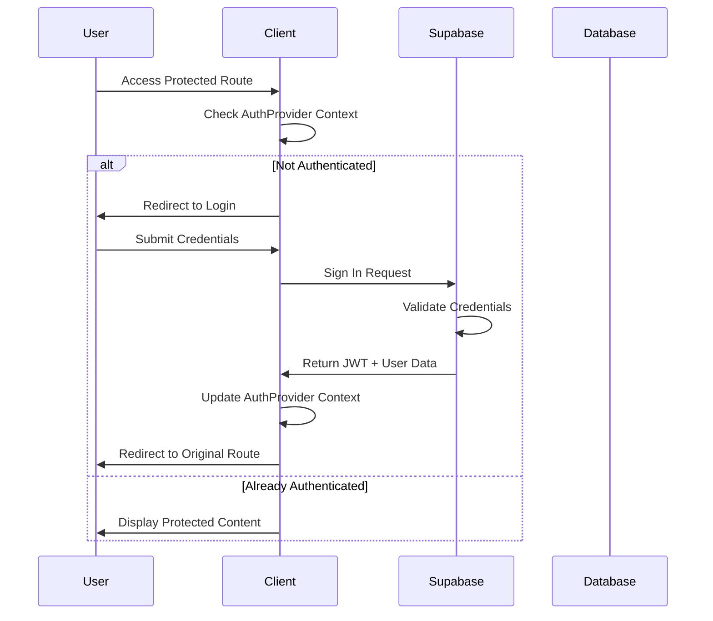

# Authentication & Authorization Architecture

## 1. Project Structure

```
src/
├── lib/
│   ├── supabase.ts             # Existing Supabase client
│   └── auth.ts                 # New auth utilities and hooks
├── components/
│   ├── auth/
│   │   ├── AuthProvider.tsx    # Global auth context
│   │   ├── LoginForm.tsx      # Login component
│   │   ├── RegisterForm.tsx   # Registration component
│   │   ├── ProtectedRoute.tsx # Route guard component
│   │   └── AuthModal.tsx      # Reusable auth modal
│   └── ...
├── types/
│   └── auth.d.ts              # Auth-related type definitions
└── hooks/
    └── useAuth.ts             # Custom auth hook

supabase/
├── migrations/
│   └── 00001_auth_schema.sql  # Auth tables and policies
└── seed/
    └── roles.sql              # Initial roles and permissions
```

## 2. Authentication Flow



## 3. Database Schema

### Users Table (Extended Supabase Auth)
```sql
-- Extends default auth.users
create table public.profiles (
    id uuid references auth.users(id) primary key,
    username text unique,
    full_name text,
    avatar_url text,
    created_at timestamptz default now(),
    updated_at timestamptz default now()
);

-- Roles and Permissions
create table public.roles (
    id uuid primary key default gen_random_uuid(),
    name text unique not null,
    description text,
    created_at timestamptz default now()
);

create table public.user_roles (
    user_id uuid references public.profiles(id),
    role_id uuid references public.roles(id),
    created_at timestamptz default now(),
    primary key (user_id, role_id)
);

create table public.permissions (
    id uuid primary key default gen_random_uuid(),
    name text unique not null,
    description text,
    created_at timestamptz default now()
);

create table public.role_permissions (
    role_id uuid references public.roles(id),
    permission_id uuid references public.permissions(id),
    created_at timestamptz default now(),
    primary key (role_id, permission_id)
);
```

## 4. Row Level Security (RLS) Policies

```sql
-- Profiles table policies
alter table public.profiles enable row level security;

create policy "Users can view any profile"
    on public.profiles for select
    using (true);

create policy "Users can update own profile"
    on public.profiles for update
    using (auth.uid() = id)
    with check (auth.uid() = id);

-- Roles table policies
alter table public.roles enable row level security;

create policy "Public read access to roles"
    on public.roles for select
    using (true);

create policy "Admin only write access to roles"
    on public.roles for insert update delete
    using (
        exists (
            select 1 from public.user_roles ur
            inner join public.roles r on r.id = ur.role_id
            where ur.user_id = auth.uid()
            and r.name = 'admin'
        )
    );

-- Similar policies for other tables...
```

## 5. Implementation Guidelines

### Authentication Context
- Implement AuthProvider using React Context for global auth state
- Store JWT and user data in memory, with optional persistence
- Handle token refresh automatically
- Provide login, logout, and registration methods

### Route Protection
- Create ProtectedRoute component for securing routes
- Support role-based access control
- Handle unauthorized access gracefully

### Security Best Practices
- Implement PKCE flow for enhanced security
- Store sensitive data in secure HTTP-only cookies
- Use environment variables for Supabase credentials
- Implement rate limiting for auth endpoints
- Add request origin validation

### Code Example (auth.ts)
```typescript
export interface User {
  id: string;
  email: string;
  username?: string;
  roles: string[];
}

export interface AuthContextType {
  user: User | null;
  loading: boolean;
  error: Error | null;
  login: (email: string, password: string) => Promise<void>;
  logout: () => Promise<void>;
  register: (email: string, password: string) => Promise<void>;
}

// Hook usage example
const { user, login, logout } = useAuth();
```

## 6. Future Extensibility

### Planned Extension Points
1. OAuth Provider Integration
   - Social login support
   - Enterprise SSO capabilities

2. Enhanced Authorization
   - Fine-grained permissions system
   - Dynamic role capabilities
   - Resource-based access control

3. Multi-factor Authentication
   - SMS/Email verification
   - Time-based OTP support
   - Hardware key support

4. Audit System
   - Authentication activity logging
   - Permission changes tracking
   - Security event monitoring

## 7. Testing Strategy

1. Unit Tests
   - Auth utility functions
   - Protected route behavior
   - Context providers

2. Integration Tests
   - Authentication flow
   - Role-based access
   - Database policies

3. E2E Tests
   - User registration
   - Login/logout flow
   - Protected route access

## 8. Performance Considerations

1. Client-side
   - Minimize auth state rerender impact
   - Efficient role checking
   - Optimistic UI updates

2. Database
   - Indexed auth queries
   - Efficient policy evaluation
   - Minimal permission checks

## 9. Security Measures

1. Prevention Strategies
   - SQL injection via prepared statements
   - XSS through content security policy
   - CSRF using tokens
   - Rate limiting on auth endpoints

2. Detection
   - Failed login monitoring
   - Suspicious activity alerts
   - Real-time security logs

3. Response
   - Account lockout procedures
   - Security incident playbooks
   - Automated threat response

## Implementation Timeline

1. Phase 1: Core Authentication (Week 1)
   - Basic auth flow
   - Database schema
   - Essential RLS policies

2. Phase 2: Authorization (Week 2)
   - Role system
   - Permission management
   - Route protection

3. Phase 3: Security Hardening (Week 3)
   - Additional security measures
   - Monitoring
   - Testing

4. Phase 4: Extended Features (Week 4)
   - Social login
   - MFA
   - Audit system