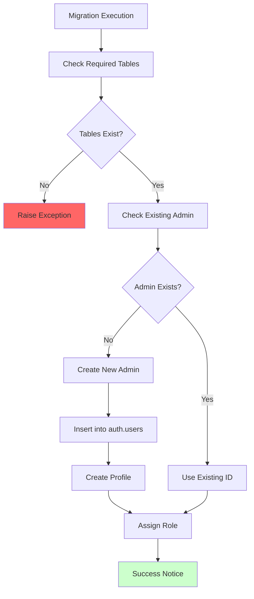
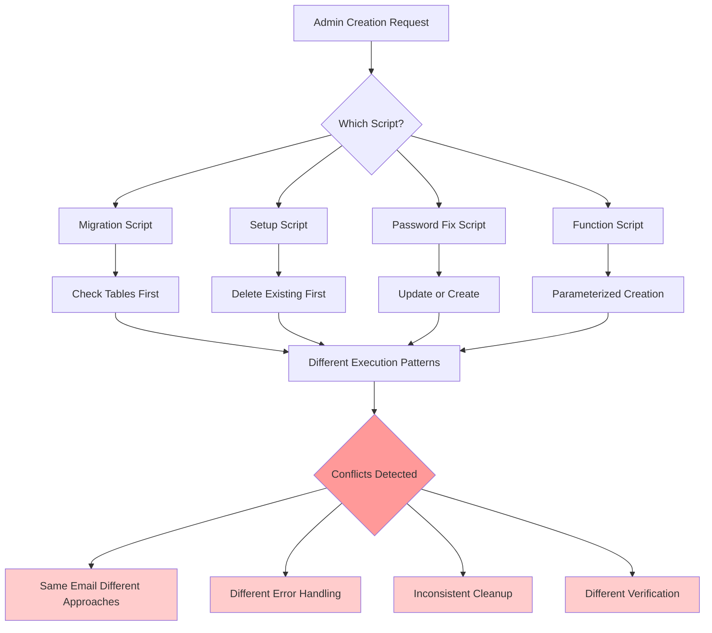
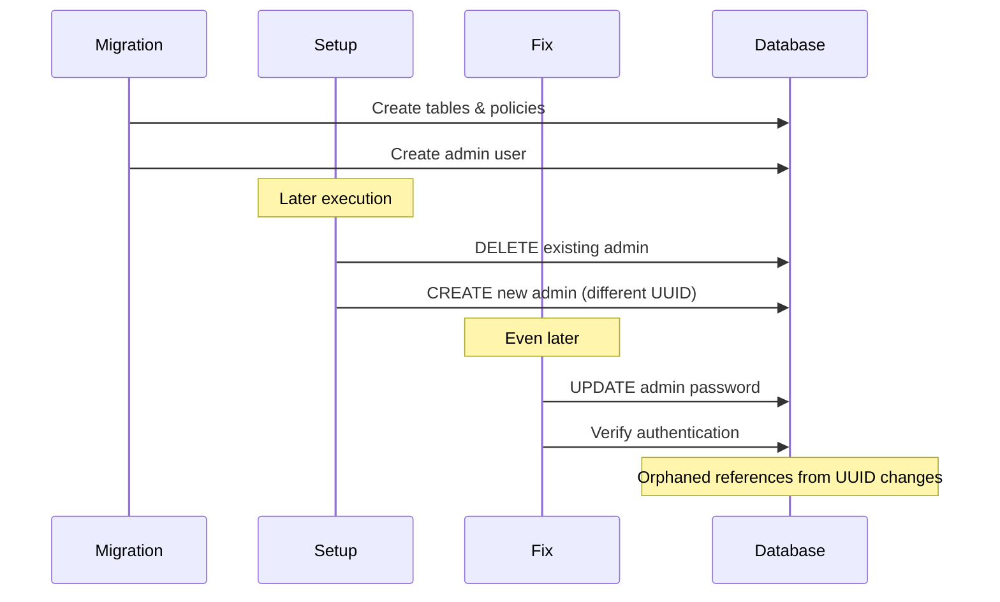

# Admin Creation Scripts Analysis

## Overview

This document analyzes the multiple admin user creation scripts found in the project, identifying conflicts, inconsistencies, and potential security issues. The presence of multiple competing scripts creates operational risks and authentication failures.

## Admin Scripts Inventory

### 1. Migration-Based Admin Creation
**File**: [`supabase/migrations/20250528205400_create_admin_user.sql`](../../supabase/migrations/20250528205400_create_admin_user.sql)



**Characteristics:**
- **Credentials**: `admin@aihow.org` / `AIhow@Admin2025`
- **Approach**: Defensive programming with existence checks
- **Error Handling**: Comprehensive exception handling
- **Security**: Uses `crypt()` with `gen_salt('bf')`

### 2. Standalone Setup Script
**File**: [`supabase/admin_setup.sql`](../../supabase/admin_setup.sql)

**Characteristics:**
- **Credentials**: `admin@aihow.org` / `AIhow@Admin2025`
- **Approach**: Clean up existing admin first
- **Security**: Uses `crypt()` with `gen_salt('bf')`
- **Integration**: Works with legacy role system only

### 3. Password Fix Script
**File**: [`supabase/admin_password_fix.sql`](../../supabase/admin_password_fix.sql)

**Characteristics:**
- **Credentials**: `admin@aihow.org` / `AIhow@Admin2025`
- **Approach**: Comprehensive password reset and verification
- **Security**: Enhanced with verification step
- **Features**: Clears rate limits and sessions

### 4. Function-Based Creation
**File**: [`supabase/functions/create_admin_user.sql`](../../supabase/functions/create_admin_user.sql)

**Characteristics:**
- **Approach**: Reusable function with parameters
- **Security**: Uses `SECURITY DEFINER`
- **Flexibility**: Accepts email, password, and full name
- **Integration**: Legacy system only

## Script Conflicts Analysis



## Detailed Script Comparison

### Password Hashing Methods

**All Scripts Use Same Method** ✅:
```sql
encrypted_password = crypt('AIhow@Admin2025', gen_salt('bf'))
```

**Security Analysis**:
- ✅ **Secure Algorithm**: bcrypt with salt
- ⚠️ **Hardcoded Password**: Same password in multiple files
- ❌ **No Password Rotation**: Password never changes

### Admin User Cleanup Strategies

**Migration Script** (Defensive):
```sql
-- Check if admin user already exists
SELECT id INTO existing_user_id
FROM auth.users
WHERE email = 'admin@aihow.org';

IF existing_user_id IS NOT NULL THEN
    RAISE NOTICE 'Admin user already exists with id: %', existing_user_id;
    admin_user_id := existing_user_id;
```

**Setup Script** (Aggressive):
```sql
-- Clean up existing admin (if any)
DELETE FROM auth.users WHERE email = admin_email;
```

**Password Fix Script** (Conditional):
```sql
IF hash_count = 0 THEN
    -- Admin user doesn't exist, create it
ELSE
    -- Admin user exists, reset the password
```

**Conflict Risk**: Different cleanup strategies can lead to inconsistent states.

### Profile Creation Differences

**Migration Script**:
```sql
-- Checks for column existence before insert
IF exists (select 1 from information_schema.columns 
           where table_name = 'profiles' and column_name = 'created_at') THEN
    INSERT INTO public.profiles (id, username, full_name, created_at, updated_at)
```

**Other Scripts**:
```sql
-- Direct insert without column checks
INSERT INTO public.profiles (id, username, full_name, updated_at)
```

**Issue**: Migration script might fail if run after other scripts that create profiles differently.

## Security Issues Identified

### 1. **CRITICAL**: Password Exposure

**Issue**: Admin password hardcoded in multiple files
```bash
# Password appears in:
grep -r "AIhow@Admin2025" supabase/
supabase/migrations/20250528205400_create_admin_user.sql
supabase/admin_setup.sql  
supabase/admin_password_fix.sql
```

**Risk**: Source code exposure reveals admin credentials

### 2. **HIGH**: Script Execution Conflicts

**Scenario**: Multiple scripts executed in sequence
```sql
-- Script 1: Migration creates admin
INSERT INTO auth.users (email, encrypted_password, ...) 
VALUES ('admin@aihow.org', ...);

-- Script 2: Setup script deletes and recreates
DELETE FROM auth.users WHERE email = 'admin@aihow.org';
INSERT INTO auth.users (email, encrypted_password, ...) 
VALUES ('admin@aihow.org', ...);  -- Different UUID generated

-- Result: References in other tables become orphaned
```

### 3. **MEDIUM**: Inconsistent Role Assignment

**Migration Script**:
```sql
-- Uses complex role creation with permissions
INSERT INTO public.role_permissions (role_id, permission_id)
SELECT r.id, p.id FROM public.roles r CROSS JOIN public.permissions p
WHERE r.name = 'admin';
```

**Other Scripts**:
```sql
-- Simple role assignment only
INSERT INTO public.user_roles (user_id, role_id)
VALUES (admin_id, role_id);
```

**Result**: Admin might have different permission sets depending on which script was used.

## Operational Issues

### 1. Script Execution Order Dependencies



### 2. Development vs Production Conflicts

**Development Environment**:
- Scripts run multiple times during testing
- Database reset frequently
- Conflicts less noticeable

**Production Environment**:
- Scripts should run once
- Data persistence critical
- Conflicts cause outages

### 3. Migration Rollback Issues

**Problem**: No consistent rollback strategy
```sql
-- Migration script rollback comment:
/*
delete from public.user_roles where user_id = (
    select id from auth.users where email = 'admin@aihow.org'
);
delete from public.profiles where username = 'admin@aihow.org';
delete from auth.users where email = 'admin@aihow.org';
*/
```

**Issue**: Other scripts don't provide rollback procedures.

## Recommended Resolution

### Immediate Actions (Priority 1)

1. **Consolidate to Single Script**:
```sql
-- Create definitive admin setup function
CREATE OR REPLACE FUNCTION setup_admin_user()
RETURNS void AS $$
DECLARE
    admin_email text := 'admin@aihow.org';
    admin_password text;  -- Get from environment
    admin_id uuid;
    role_id uuid;
BEGIN
    -- Get password from secure config
    SELECT current_setting('app.admin_password', true) INTO admin_password;
    IF admin_password IS NULL THEN
        RAISE EXCEPTION 'Admin password not configured';
    END IF;
    
    -- Idempotent admin creation logic
    -- ...
END;
$$;
```

2. **Remove Hardcoded Passwords**:
```bash
# Use environment variables
export ADMIN_PASSWORD=$(openssl rand -base64 32)
psql -v admin_password="$ADMIN_PASSWORD" -f setup_admin.sql
```

3. **Create Verification Script**:
```sql
-- Verify admin setup consistency
CREATE OR REPLACE FUNCTION verify_admin_setup()
RETURNS TABLE(check_name text, status text, details text) AS $$
BEGIN
    RETURN QUERY
    SELECT 'Admin User Exists'::text, 
           CASE WHEN EXISTS(SELECT 1 FROM auth.users WHERE email = 'admin@aihow.org')
                THEN 'PASS' ELSE 'FAIL' END::text,
           'Admin user in auth.users'::text;
    -- Additional checks...
END;
$$;
```

### Medium-term Improvements (Priority 2)

1. **Environment-Based Configuration**:
```sql
-- Use Supabase secrets for admin config
SELECT vault.create_secret('admin_email', 'admin@aihow.org');
SELECT vault.create_secret('admin_password', generate_random_password());
```

2. **Automated Testing**:
```bash
#!/bin/bash
# Test admin creation scripts
for script in supabase/admin_*.sql; do
    echo "Testing $script"
    # Reset test database
    # Run script
    # Verify results
    # Rollback
done
```

3. **Documentation Update**:
```markdown
# Admin Setup Procedure
1. Run: `supabase/functions/setup_admin_user.sql`
2. Verify: `SELECT verify_admin_setup();`
3. Change password on first login
```

### Long-term Architecture (Priority 3)

1. **Admin Account Lifecycle Management**
2. **Multi-Factor Authentication Setup**
3. **Role-Based Admin Creation**
4. **Automated Password Rotation**

## Script Usage Recommendations

### For New Deployments
**Use**: `supabase/functions/create_admin_user.sql` (function-based approach)
**Reason**: Most flexible and reusable

### For Existing Deployments
**Use**: `supabase/admin_password_fix.sql` 
**Reason**: Handles existing users safely

### For Development
**Use**: `supabase/admin_setup.sql`
**Reason**: Clean slate approach suitable for development

### For Production Migrations
**Use**: Custom script combining best practices from all scripts
**Reason**: Production requires maximum safety and verification

---

**Risk Assessment**: **HIGH** - Multiple conflicting scripts create operational risks  
**Recommended Action**: Immediate consolidation required  
**Priority**: P1 - Block deployments until resolved