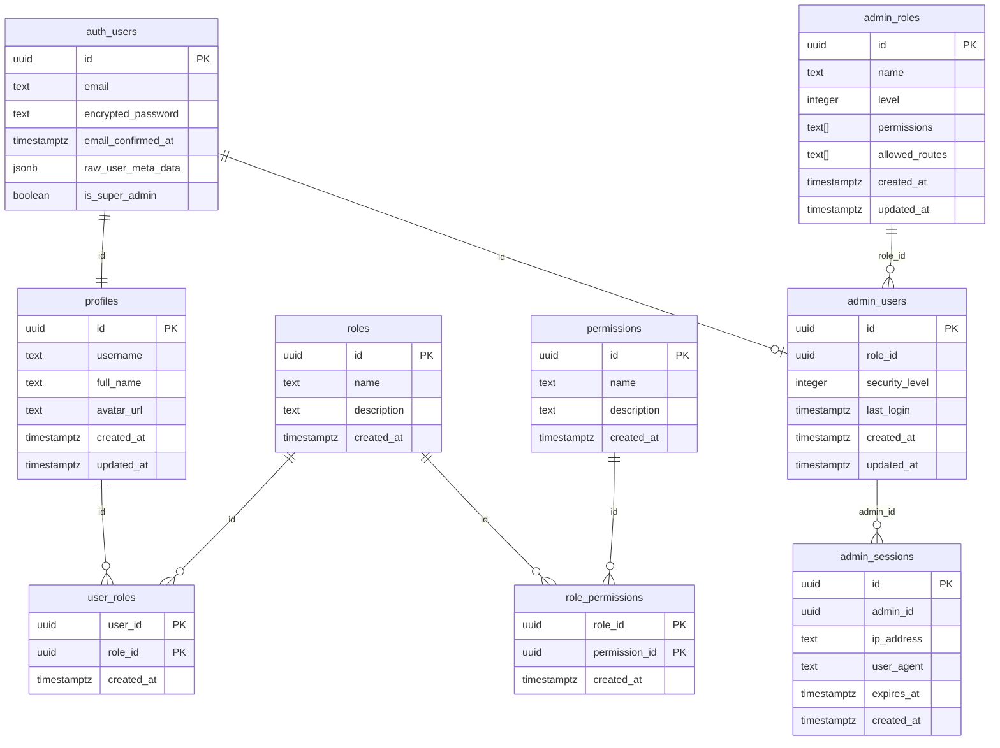
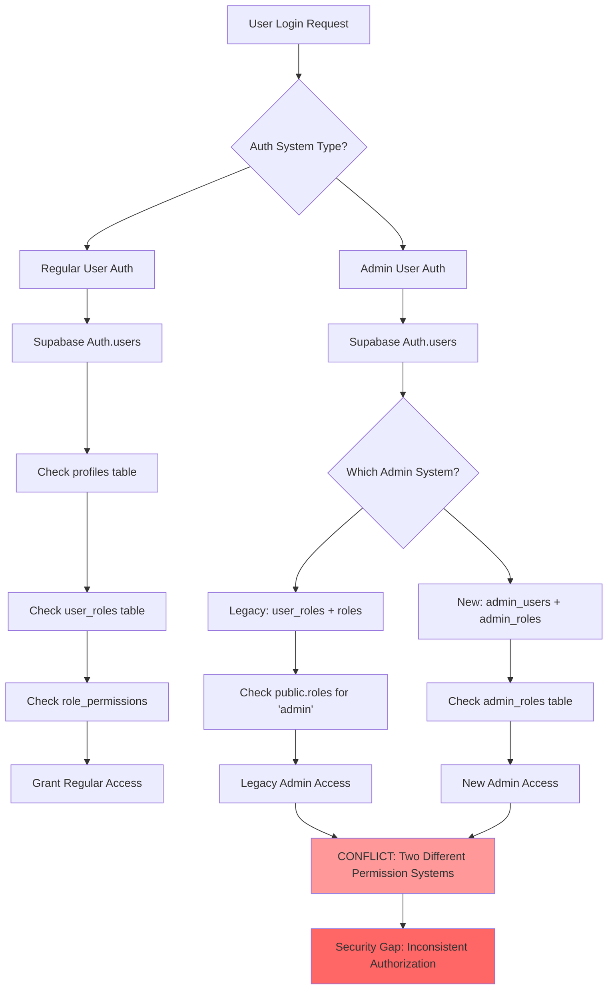
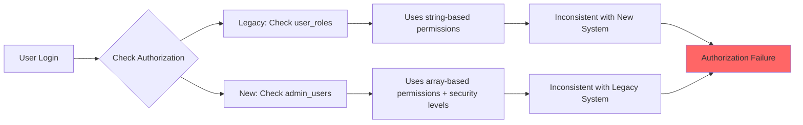

# Database Authentication Architecture Analysis

## Executive Summary

This document provides a comprehensive analysis of the current database schema and authentication architecture for the AIhow platform. The analysis reveals a **dual authentication system** with significant architectural inconsistencies, security gaps, and integration challenges that require immediate attention.

## Critical Findings

🔴 **CRITICAL ISSUES IDENTIFIED:**
1. **Dual Authentication Systems**: Two separate admin auth systems that conflict with each other
2. **Schema Inconsistency**: Multiple role/permission models that don't integrate properly
3. **Security Vulnerabilities**: Missing RLS policies and inconsistent permission checks
4. **Admin User Creation Issues**: Multiple competing admin creation scripts causing conflicts

## Current Database Schema Overview

## Authentication Flow Analysis

## Schema Conflicts and Issues

### 1. Dual Role Systems

The project has **TWO SEPARATE** role and permission systems:

#### Legacy System (Basic)
- [`public.roles`](supabase/migrations/20250528205100_create_roles_and_permissions.sql:4-9) - Simple role table
- [`public.permissions`](supabase/migrations/20250528205100_create_roles_and_permissions.sql:12-17) - Basic permissions 
- [`public.user_roles`](supabase/migrations/20250528205100_create_roles_and_permissions.sql:20-25) - User-role assignments
- [`public.role_permissions`](supabase/migrations/20250528205100_create_roles_and_permissions.sql:27-32) - Role-permission mapping

#### New Admin System (Advanced)
- [`admin_roles`](supabase/migrations/20250531123000_admin_auth_schema.sql:6-14) - Advanced role table with levels
- [`admin_users`](supabase/migrations/20250531123000_admin_auth_schema.sql:16-24) - Admin-specific user table
- [`admin_sessions`](supabase/migrations/20250531123000_admin_auth_schema.sql:26-34) - Admin session management

### 2. Permission Model Conflicts

### 3. RLS Policy Issues

The Row Level Security policies show inconsistent patterns:

#### Problems Identified:
1. **Circular Dependencies**: Admin policies check [`user_roles`](supabase/migrations/20250528205200_create_rls_policies.sql:13-17) but admin tables use different structure
2. **Missing Policies**: No RLS policies for admin portal content tables
3. **Overly Permissive**: Some policies use `using (true)` which bypasses security
4. **Performance Issues**: Complex nested queries in RLS policies

## Admin User Creation Conflicts

Multiple admin creation scripts exist with different approaches:

1. **[`20250528205400_create_admin_user.sql`](supabase/migrations/20250528205400_create_admin_user.sql)** - Migration-based creation
2. **[`admin_setup.sql`](supabase/admin_setup.sql)** - Standalone script  
3. **[`admin_password_fix.sql`](supabase/admin_password_fix.sql)** - Password fixing script
4. **[`create_admin_user.sql`](supabase/functions/create_admin_user.sql)** - Function-based creation

Each script has different:
- Password hashing methods
- Default credentials
- Error handling
- Profile creation logic

## Security Vulnerabilities

### 1. Authentication Bypass Risks
- Multiple admin creation scripts can create conflicting accounts
- Legacy role system bypasses new admin security controls
- Missing session validation between systems

### 2. Authorization Inconsistencies
- Admin users might fall through to regular user permissions
- Two different permission checking mechanisms
- Potential privilege escalation between systems

### 3. Session Management Issues
- No unified session management
- [`admin_sessions`](supabase/migrations/20250531123000_admin_auth_schema.sql:26-34) table not integrated with Supabase auth
- Missing session cleanup and timeout handling

## Architectural Recommendations

### Immediate Actions Required (Priority 1)
1. **Consolidate Authentication Systems** - Choose one system and migrate
2. **Fix RLS Policies** - Ensure consistent security model  
3. **Clean Up Admin Creation** - Use single, tested admin creation method
4. **Audit Existing Data** - Check for inconsistent user/admin records

### Medium-term Improvements (Priority 2)
1. **Implement Proper Session Management**
2. **Add Comprehensive Audit Logging**
3. **Create Migration Scripts** for data consolidation
4. **Enhance Permission Granularity**

### Long-term Strategic Changes (Priority 3)
1. **Consider External Auth Provider** for admin accounts
2. **Implement MFA** for admin access
3. **Add Real-time Security Monitoring**
4. **Create Admin Account Lifecycle Management**

## Related Documentation

- [Schema Conflicts Analysis](./DATABASE_SCHEMA_CONFLICTS.md)
- [RLS Policy Analysis](./DATABASE_RLS_ANALYSIS.md) 
- [Admin Creation Scripts Analysis](./DATABASE_ADMIN_SCRIPTS_ANALYSIS.md)
- [Security Vulnerabilities Report](./DATABASE_SECURITY_ANALYSIS.md)
- [Migration Recommendations](./DATABASE_MIGRATION_PLAN.md)

## Next Steps

1. **Review this analysis** with the development team
2. **Prioritize fixes** based on security impact
3. **Create detailed migration plan** for consolidation
4. **Implement comprehensive testing** before any changes
5. **Establish monitoring** for authentication issues

---

**Analysis completed**: January 6, 2025  
**Analyst**: Database Architecture Review  
**Status**: Critical Issues Identified - Immediate Action Required