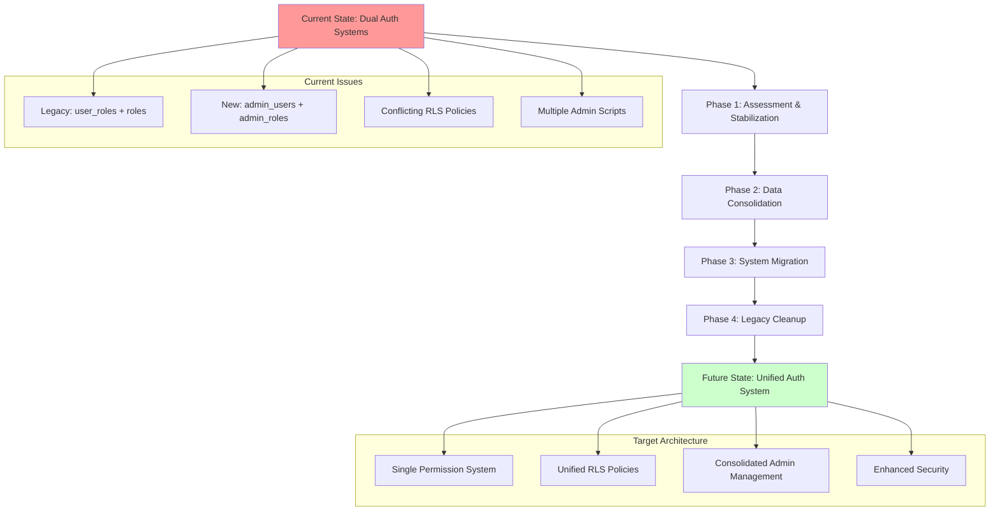

# Database Authentication Migration Plan

## Overview

This document provides a comprehensive migration plan to resolve the dual authentication system conflicts and establish a unified, secure database architecture. The plan prioritizes safety, minimal downtime, and data integrity.

## Migration Strategy



## Phase 1: Assessment & Stabilization (Week 1)

### 1.1 Current State Analysis

**Data Audit Script**:
```sql
-- Comprehensive audit of current authentication state
CREATE OR REPLACE FUNCTION audit_auth_system()
RETURNS TABLE(
    audit_category text,
    item_count bigint,
    details jsonb
) AS $$
BEGIN
    -- Users in auth.users
    RETURN QUERY
    SELECT 'Total Users'::text, count(*)::bigint, '{}'::jsonb
    FROM auth.users;
    
    -- Users with profiles
    RETURN QUERY
    SELECT 'Users with Profiles'::text, count(*)::bigint, '{}'::jsonb
    FROM auth.users u
    JOIN public.profiles p ON p.id = u.id;
    
    -- Users with legacy admin roles
    RETURN QUERY
    SELECT 'Legacy Admin Users'::text, count(*)::bigint, 
           jsonb_build_object('emails', array_agg(u.email))
    FROM auth.users u
    JOIN public.user_roles ur ON ur.user_id = u.id
    JOIN public.roles r ON r.id = ur.role_id
    WHERE r.name = 'admin';
    
    -- Users in new admin system
    RETURN QUERY
    SELECT 'New Admin System Users'::text, count(*)::bigint,
           jsonb_build_object('security_levels', array_agg(au.security_level))
    FROM admin_users au;
    
    -- Orphaned records
    RETURN QUERY
    SELECT 'Orphaned Profiles'::text, count(*)::bigint, '{}'::jsonb
    FROM public.profiles p
    WHERE NOT EXISTS (SELECT 1 FROM auth.users u WHERE u.id = p.id);
    
    -- Conflicting admin users (in both systems)
    RETURN QUERY
    SELECT 'Conflicting Admin Users'::text, count(*)::bigint,
           jsonb_build_object('user_ids', array_agg(u.id))
    FROM auth.users u
    WHERE EXISTS (
        SELECT 1 FROM public.user_roles ur
        JOIN public.roles r ON r.id = ur.role_id
        WHERE ur.user_id = u.id AND r.name = 'admin'
    ) AND EXISTS (
        SELECT 1 FROM admin_users au WHERE au.id = u.id
    );
END;
$$;

-- Execute audit
SELECT * FROM audit_auth_system();
```

### 1.2 Immediate Security Fixes

**Stop Privilege Escalation**:
```sql
-- Temporarily restrict admin role assignments
DROP POLICY IF EXISTS "Admin can manage user roles" ON public.user_roles;

CREATE POLICY "Restricted admin role management"
    ON public.user_roles FOR ALL
    USING (
        -- Only super admins can manage roles
        EXISTS (
            SELECT 1 FROM admin_users au
            WHERE au.id = auth.uid() AND au.security_level >= 100
        )
        OR
        -- Legacy admins can only view, not modify
        (TG_OP = 'SELECT' AND EXISTS (
            SELECT 1 FROM public.user_roles ur
            JOIN public.roles r ON r.id = ur.role_id  
            WHERE ur.user_id = auth.uid() AND r.name = 'admin'
        ))
    );
```

**Profile Privacy Fix**:
```sql
-- Fix overly permissive profile access
DROP POLICY IF EXISTS "Users can view any profile" ON public.profiles;

CREATE POLICY "Restricted profile access"
    ON public.profiles FOR SELECT
    USING (
        auth.uid() = id  -- Own profile
        OR
        EXISTS (  -- Admin access
            SELECT 1 FROM admin_users au
            WHERE au.id = auth.uid() AND au.security_level >= 80
        )
    );
```

### 1.3 Create Migration Infrastructure

**Migration Tracking Table**:
```sql
CREATE TABLE auth_migration_log (
    id uuid PRIMARY KEY DEFAULT gen_random_uuid(),
    phase text NOT NULL,
    step text NOT NULL,
    status text NOT NULL DEFAULT 'pending',
    started_at timestamptz DEFAULT now(),
    completed_at timestamptz,
    error_message text,
    rollback_sql text,
    metadata jsonb DEFAULT '{}'
);

-- Migration helper functions
CREATE OR REPLACE FUNCTION log_migration_step(
    p_phase text,
    p_step text,
    p_status text DEFAULT 'completed',
    p_error text DEFAULT NULL,
    p_rollback_sql text DEFAULT NULL,
    p_metadata jsonb DEFAULT '{}'
) RETURNS void AS $$
BEGIN
    INSERT INTO auth_migration_log (
        phase, step, status, completed_at, error_message, rollback_sql, metadata
    ) VALUES (
        p_phase, p_step, p_status, 
        CASE WHEN p_status = 'completed' THEN now() ELSE NULL END,
        p_error, p_rollback_sql, p_metadata
    );
END;
$$;
```

## Phase 2: Data Consolidation (Week 2)

### 2.1 Choose Target System

**Decision Matrix**:

| Criteria | Legacy System | New Admin System | Winner |
|----------|---------------|------------------|---------|
| **Flexibility** | Basic roles | Hierarchical levels + arrays | 🏆 New |
| **Security** | Basic RLS | Enhanced with sessions | 🏆 New |
| **Performance** | Simple queries | Optimized indexes | 🏆 New |
| **Features** | Limited | MFA, sessions, audit | 🏆 New |
| **Complexity** | Simple | More complex | Legacy |
| **Future-proof** | Limited | Extensible | 🏆 New |

**Recommendation**: Migrate to enhanced new admin system with backward compatibility.

### 2.2 Data Migration Strategy

**Step 1: Migrate Admin Users**:
```sql
-- Migrate legacy admins to new system
CREATE OR REPLACE FUNCTION migrate_legacy_admins()
RETURNS void AS $$
DECLARE
    legacy_admin record;
    super_admin_role_id uuid;
BEGIN
    -- Get or create SUPER_ADMIN role
    SELECT id INTO super_admin_role_id 
    FROM admin_roles WHERE name = 'SUPER_ADMIN';
    
    IF super_admin_role_id IS NULL THEN
        INSERT INTO admin_roles (name, level, permissions, allowed_routes)
        VALUES ('SUPER_ADMIN', 100, ARRAY['*'], ARRAY['*'])
        RETURNING id INTO super_admin_role_id;
    END IF;
    
    -- Migrate each legacy admin
    FOR legacy_admin IN
        SELECT DISTINCT u.id, u.email, p.full_name
        FROM auth.users u
        JOIN public.profiles p ON p.id = u.id
        JOIN public.user_roles ur ON ur.user_id = u.id
        JOIN public.roles r ON r.id = ur.role_id
        WHERE r.name = 'admin'
        AND NOT EXISTS (SELECT 1 FROM admin_users au WHERE au.id = u.id)
    LOOP
        -- Create admin_users record
        INSERT INTO admin_users (id, role_id, security_level, last_login)
        VALUES (
            legacy_admin.id, 
            super_admin_role_id, 
            100,  -- Super admin level
            now()
        );
        
        -- Log migration
        PERFORM log_migration_step(
            'data_consolidation',
            'migrate_admin_user',
            'completed',
            NULL,
            format('DELETE FROM admin_users WHERE id = %L', legacy_admin.id),
            jsonb_build_object('user_email', legacy_admin.email)
        );
    END LOOP;
END;
$$;

-- Execute migration
SELECT migrate_legacy_admins();
```

**Step 2: Migrate Regular Users**:
```sql
-- Ensure all regular users have proper role assignment
CREATE OR REPLACE FUNCTION ensure_user_roles()
RETURNS void AS $$
DECLARE
    user_record record;
    user_role_id uuid;
BEGIN
    -- Get or create 'user' role
    SELECT id INTO user_role_id FROM public.roles WHERE name = 'user';
    
    -- Assign user role to users without any role
    FOR user_record IN
        SELECT u.id, u.email
        FROM auth.users u
        JOIN public.profiles p ON p.id = u.id
        WHERE NOT EXISTS (
            SELECT 1 FROM public.user_roles ur WHERE ur.user_id = u.id
        )
        AND NOT EXISTS (
            SELECT 1 FROM admin_users au WHERE au.id = u.id
        )
    LOOP
        INSERT INTO public.user_roles (user_id, role_id)
        VALUES (user_record.id, user_role_id);
        
        PERFORM log_migration_step(
            'data_consolidation',
            'assign_user_role',
            'completed',
            NULL,
            format('DELETE FROM public.user_roles WHERE user_id = %L', user_record.id),
            jsonb_build_object('user_email', user_record.email)
        );
    END LOOP;
END;
$$;
```

### 2.3 Validation and Testing

**Data Integrity Checks**:
```sql
CREATE OR REPLACE FUNCTION validate_migration()
RETURNS TABLE(check_name text, status text, details text) AS $$
BEGIN
    -- Check 1: All admins migrated
    RETURN QUERY
    SELECT 'Admin Migration Complete'::text,
           CASE WHEN count(*) = 0 THEN 'PASS' ELSE 'FAIL' END::text,
           format('%s legacy admins not migrated', count(*))::text
    FROM auth.users u
    JOIN public.user_roles ur ON ur.user_id = u.id
    JOIN public.roles r ON r.id = ur.role_id
    WHERE r.name = 'admin'
    AND NOT EXISTS (SELECT 1 FROM admin_users au WHERE au.id = u.id);
    
    -- Check 2: No orphaned records
    RETURN QUERY
    SELECT 'No Orphaned Profiles'::text,
           CASE WHEN count(*) = 0 THEN 'PASS' ELSE 'FAIL' END::text,
           format('%s orphaned profiles found', count(*))::text
    FROM public.profiles p
    WHERE NOT EXISTS (SELECT 1 FROM auth.users u WHERE u.id = p.id);
    
    -- Check 3: All users have roles
    RETURN QUERY
    SELECT 'All Users Have Roles'::text,
           CASE WHEN count(*) = 0 THEN 'PASS' ELSE 'FAIL' END::text,
           format('%s users without roles', count(*))::text
    FROM auth.users u
    JOIN public.profiles p ON p.id = u.id
    WHERE NOT EXISTS (
        SELECT 1 FROM public.user_roles ur WHERE ur.user_id = u.id
    ) AND NOT EXISTS (
        SELECT 1 FROM admin_users au WHERE au.id = u.id
    );
END;
$$;

-- Run validation
SELECT * FROM validate_migration();
```

## Phase 3: System Migration (Week 3)

### 3.1 Update RLS Policies

**Unified Admin Check Function**:
```sql
CREATE OR REPLACE FUNCTION is_admin_user(user_id uuid)
RETURNS boolean AS $$
BEGIN
    -- Check new admin system first (preferred)
    RETURN EXISTS (
        SELECT 1 FROM admin_users au
        WHERE au.id = user_id AND au.security_level >= 80
    );
END;
$$;

CREATE OR REPLACE FUNCTION get_user_security_level(user_id uuid)
RETURNS integer AS $$
DECLARE
    security_level integer;
BEGIN
    SELECT au.security_level INTO security_level
    FROM admin_users au
    WHERE au.id = user_id;
    
    -- Return 0 for non-admin users
    RETURN COALESCE(security_level, 0);
END;
$$;
```

**Migrate RLS Policies**:
```sql
-- Update all admin-checking policies to use new system
DO $$
DECLARE
    policy_record record;
BEGIN
    -- Find all policies that check for admin role
    FOR policy_record IN
        SELECT schemaname, tablename, policyname, qual
        FROM pg_policies 
        WHERE qual LIKE '%r.name = ''admin''%'
    LOOP
        -- Log policy update
        PERFORM log_migration_step(
            'system_migration',
            'update_rls_policy',
            'pending',
            NULL,
            NULL,
            jsonb_build_object(
                'table', policy_record.tablename,
                'policy', policy_record.policyname
            )
        );
        
        -- Update policy (example for roles table)
        IF policy_record.tablename = 'roles' AND policy_record.policyname LIKE '%Admin only%' THEN
            EXECUTE format(
                'DROP POLICY IF EXISTS %I ON %I.%I',
                policy_record.policyname,
                policy_record.schemaname,
                policy_record.tablename
            );
            
            EXECUTE format(
                'CREATE POLICY %I ON %I.%I FOR %s TO authenticated USING (is_admin_user(auth.uid()))',
                policy_record.policyname,
                policy_record.schemaname,
                policy_record.tablename,
                'ALL'  -- Adjust based on original policy
            );
        END IF;
        
        -- Mark as completed
        UPDATE auth_migration_log 
        SET status = 'completed', completed_at = now()
        WHERE phase = 'system_migration' 
        AND step = 'update_rls_policy'
        AND metadata->>'policy' = policy_record.policyname;
    END LOOP;
END;
$$;
```

### 3.2 Update Application Code

**API Changes Required**:
```typescript
// Before: Multiple permission check methods
const isAdmin = await checkLegacyAdminRole(userId);
const hasPermission = await checkPermission(userId, 'manage_content');

// After: Unified permission system
const userSecurity = await getUserSecurityLevel(userId);
const isAdmin = userSecurity >= 80;
const hasPermission = await checkAdminPermission(userId, 'manage_content');
```

**Database Function for Application**:
```sql
-- Application-friendly permission check
CREATE OR REPLACE FUNCTION check_user_permission(
    user_id uuid,
    required_permission text,
    min_security_level integer DEFAULT 80
) RETURNS boolean AS $$
DECLARE
    user_level integer;
    role_permissions text[];
BEGIN
    -- Get user security level and permissions
    SELECT au.security_level, ar.permissions
    INTO user_level, role_permissions
    FROM admin_users au
    JOIN admin_roles ar ON ar.id = au.role_id
    WHERE au.id = user_id;
    
    -- Check if user meets security level requirement
    IF user_level >= min_security_level THEN
        -- Check if user has specific permission or wildcard
        RETURN role_permissions @> ARRAY[required_permission] 
               OR role_permissions @> ARRAY['*'];
    END IF;
    
    -- Non-admin users: check legacy permission system
    RETURN EXISTS (
        SELECT 1 FROM public.user_roles ur
        JOIN public.role_permissions rp ON rp.role_id = ur.role_id
        JOIN public.permissions p ON p.id = rp.permission_id
        WHERE ur.user_id = user_id AND p.name = required_permission
    );
END;
$$;
```

## Phase 4: Legacy Cleanup (Week 4)

### 4.1 Deprecate Legacy Admin System

**Mark Legacy Tables as Deprecated**:
```sql
-- Add deprecation notice to legacy tables
COMMENT ON TABLE public.roles IS 'DEPRECATED: Use admin_roles for admin users. Will be removed in next major version.';
COMMENT ON TABLE public.permissions IS 'DEPRECATED: Use admin_roles.permissions array. Will be removed in next major version.';

-- Create view for backward compatibility
CREATE VIEW legacy_admin_view AS
SELECT 
    u.id,
    u.email,
    'admin'::text as role_name,
    au.security_level,
    ar.permissions
FROM auth.users u
JOIN admin_users au ON au.id = u.id
JOIN admin_roles ar ON ar.id = au.role_id;
```

### 4.2 Clean Up Admin Creation Scripts

**Single Authoritative Script**:
```sql
-- supabase/functions/setup_admin_system.sql
CREATE OR REPLACE FUNCTION setup_admin_system(
    admin_email text DEFAULT 'admin@aihow.org',
    admin_password text DEFAULT NULL
) RETURNS jsonb AS $$
DECLARE
    admin_id uuid;
    super_admin_role_id uuid;
    result jsonb;
BEGIN
    -- Validate input
    IF admin_password IS NULL THEN
        RAISE EXCEPTION 'Admin password must be provided';
    END IF;
    
    -- Create or get super admin role
    INSERT INTO admin_roles (name, level, permissions, allowed_routes)
    VALUES ('SUPER_ADMIN', 100, ARRAY['*'], ARRAY['*'])
    ON CONFLICT (name) DO UPDATE SET updated_at = now()
    RETURNING id INTO super_admin_role_id;
    
    -- Create or update admin user in auth.users
    INSERT INTO auth.users (
        email, encrypted_password, email_confirmed_at,
        raw_user_meta_data, created_at, updated_at
    )
    VALUES (
        admin_email,
        crypt(admin_password, gen_salt('bf')),
        now(),
        '{"role": "admin"}'::jsonb,
        now(), now()
    )
    ON CONFLICT (email) DO UPDATE SET
        encrypted_password = EXCLUDED.encrypted_password,
        updated_at = now()
    RETURNING id INTO admin_id;
    
    -- Create profile
    INSERT INTO public.profiles (id, username, full_name)
    VALUES (admin_id, admin_email, 'System Administrator')
    ON CONFLICT (id) DO UPDATE SET
        full_name = EXCLUDED.full_name,
        updated_at = now();
    
    -- Create admin_users record
    INSERT INTO admin_users (id, role_id, security_level)
    VALUES (admin_id, super_admin_role_id, 100)
    ON CONFLICT (id) DO UPDATE SET
        role_id = EXCLUDED.role_id,
        security_level = EXCLUDED.security_level,
        updated_at = now();
    
    -- Return setup summary
    result := jsonb_build_object(
        'admin_id', admin_id,
        'email', admin_email,
        'role_id', super_admin_role_id,
        'security_level', 100,
        'setup_completed_at', now()
    );
    
    PERFORM log_migration_step(
        'admin_setup',
        'create_admin_user',
        'completed',
        NULL,
        format('DELETE FROM admin_users WHERE id = %L', admin_id),
        result
    );
    
    RETURN result;
END;
$$;
```

### 4.3 Performance Optimization

**Add Indexes**:
```sql
-- Optimize admin permission checks
CREATE INDEX CONCURRENTLY IF NOT EXISTS idx_admin_users_security_level 
ON admin_users (id, security_level) WHERE security_level >= 80;

CREATE INDEX CONCURRENTLY IF NOT EXISTS idx_admin_roles_permissions
ON admin_roles USING gin(permissions);

-- Optimize profile access
CREATE INDEX CONCURRENTLY IF NOT EXISTS idx_profiles_updated_at
ON public.profiles (updated_at DESC);
```

**Optimize RLS Policies**:
```sql
-- Replace complex RLS policies with function calls
CREATE POLICY "Optimized admin content access"
    ON public.content_items FOR ALL TO authenticated
    USING (is_admin_user(auth.uid()));

-- Enable RLS policy caching where possible
ALTER TABLE admin_users SET (autovacuum_enabled = on);
ALTER TABLE admin_roles SET (autovacuum_enabled = on);
```

## Testing Strategy

### Unit Tests
```sql
-- Test admin permission checking
DO $$
DECLARE
    test_admin_id uuid;
    test_result boolean;
BEGIN
    -- Create test admin
    SELECT setup_admin_system('test@example.com', 'test_password')->>'admin_id' INTO test_admin_id;
    
    -- Test permission check
    SELECT check_user_permission(test_admin_id::uuid, 'manage_content') INTO test_result;
    
    IF NOT test_result THEN
        RAISE EXCEPTION 'Admin permission check failed';
    END IF;
    
    -- Cleanup
    DELETE FROM admin_users WHERE id = test_admin_id::uuid;
    DELETE FROM auth.users WHERE id = test_admin_id::uuid;
    
    RAISE NOTICE 'Admin permission test passed';
END;
$$;
```

### Integration Tests
```bash
#!/bin/bash
# test_migration.sh

echo "Testing migration phases..."

# Phase 1: Run audit
psql -f scripts/audit_auth_system.sql

# Phase 2: Test data migration
psql -f scripts/test_data_migration.sql

# Phase 3: Test RLS policies
psql -f scripts/test_rls_policies.sql

# Phase 4: Test cleanup
psql -f scripts/test_cleanup.sql

echo "All migration tests completed"
```

## Rollback Strategy

### Automated Rollback
```sql
CREATE OR REPLACE FUNCTION rollback_migration(target_phase text)
RETURNS void AS $$
DECLARE
    rollback_step record;
BEGIN
    -- Execute rollback steps in reverse order
    FOR rollback_step IN
        SELECT rollback_sql, metadata
        FROM auth_migration_log
        WHERE phase >= target_phase
        AND rollback_sql IS NOT NULL
        ORDER BY started_at DESC
    LOOP
        -- Execute rollback SQL
        EXECUTE rollback_step.rollback_sql;
        
        -- Log rollback
        INSERT INTO auth_migration_log (phase, step, status, metadata)
        VALUES ('rollback', 'execute_rollback', 'completed', rollback_step.metadata);
    END LOOP;
END;
$$;

-- Usage: SELECT rollback_migration('data_consolidation');
```

## Success Criteria

### Phase 1 Complete
- [ ] Current state audit completed
- [ ] Security vulnerabilities patched
- [ ] Migration infrastructure created
- [ ] All admin creation scripts consolidated

### Phase 2 Complete
- [ ] All legacy admins migrated to new system
- [ ] Data integrity validation passed
- [ ] No orphaned records exist
- [ ] Backward compatibility maintained

### Phase 3 Complete
- [ ] All RLS policies updated
- [ ] Application code updated
- [ ] Performance benchmarks met
- [ ] Security audit passed

### Phase 4 Complete
- [ ] Legacy system deprecated
- [ ] Performance optimized
- [ ] Documentation updated
- [ ] Team training completed

## Risk Mitigation

### High-Risk Activities
1. **Data Migration**: Use transactions and verification
2. **RLS Policy Updates**: Test in staging first
3. **Code Deployment**: Blue-green deployment strategy
4. **Performance Changes**: Monitor closely

### Backup Strategy
```bash
# Before each phase
pg_dump --schema-only database > schema_backup_phase_N.sql
pg_dump --data-only --table=auth.users --table=public.* database > data_backup_phase_N.sql
```

### Monitoring
```sql
-- Monitor migration progress
CREATE VIEW migration_status AS
SELECT 
    phase,
    count(*) as total_steps,
    count(*) FILTER (WHERE status = 'completed') as completed_steps,
    count(*) FILTER (WHERE status = 'failed') as failed_steps
FROM auth_migration_log
GROUP BY phase
ORDER BY min(started_at);
```

---

**Migration Timeline**: 4 weeks  
**Risk Level**: Medium (with proper testing and rollback procedures)  
**Team Requirements**: Database architect, backend developer, security specialist  
**Success Probability**: High (with phased approach and comprehensive testing)