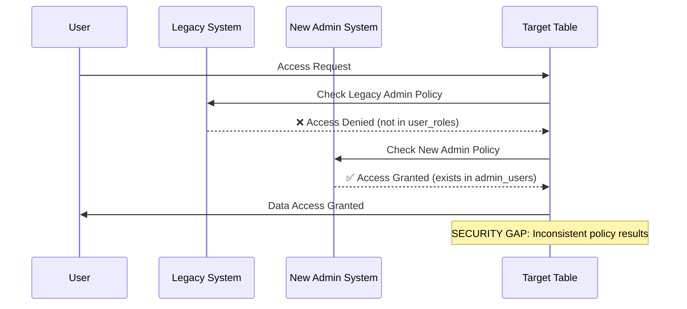

# Row Level Security (RLS) Policy Analysis

## Overview

This document analyzes the Row Level Security policies implemented across the authentication system, identifying security vulnerabilities, performance issues, and policy conflicts that create potential security gaps.

## RLS Policy Architecture

```mermaid
graph TD
    A[User Request] --> B[Table Access]
    B --> C{RLS Enabled?}
    
    C --> |Yes| D[Execute RLS Policy]
    C --> |No| E[⚠️ SECURITY RISK: Full Access]
    
    D --> F{Policy Check}
    F --> G[Legacy Admin Check]
    F --> H[New Admin Check]  
    F --> I[User Self-Access Check]
    F --> J[Public Access Check]
    
    G --> K[Query user_roles + roles]
    H --> L[Query admin_users]
    I --> M[Check auth.uid() = record.id]
    J --> N[Allow all: using(true)]
    
    K --> O{Admin Role Found?}
    L --> P{Security Level OK?}
    M --> Q{User Matches?}
    N --> R[Grant Access]
    
    O --> |Yes| R
    O --> |No| S[Deny Access]
    P --> |Yes| R
    P --> |No| S
    Q --> |Yes| R
    Q --> |No| S
    
    style E fill:#ff6666
    style S fill:#ffcccc
    style R fill:#ccffcc
```

## Policy Categories Analysis

### 1. Profile Table Policies

**Current Policies:**
```sql
-- From create_profiles.sql lines 15-22
CREATE POLICY "Users can view any profile"
    ON public.profiles FOR SELECT
    USING (true);

CREATE POLICY "Users can update own profile"
    ON public.profiles FOR UPDATE
    USING (auth.uid() = id)
    WITH CHECK (auth.uid() = id);
```

**Analysis:**
- ✅ **Secure Self-Update**: Users can only update their own profiles
- ⚠️ **Overly Permissive Read**: All users can view all profiles
- ❌ **Missing Insert Policy**: No policy for profile creation
- ❌ **Missing Delete Policy**: No policy for profile deletion

**Security Risk Level**: **MEDIUM** - Privacy concerns with public profile access

### 2. Role Management Policies

**Current Policies:**
```sql
-- From create_rls_policies.sql lines 4-48
CREATE POLICY "Public read access to roles"
    ON public.roles FOR SELECT
    USING (true);

CREATE POLICY "Admin only insert access to roles"
    ON public.roles FOR INSERT
    WITH CHECK (
        EXISTS (
            SELECT 1 FROM public.user_roles ur
            INNER JOIN public.roles r ON r.id = ur.role_id
            WHERE ur.user_id = auth.uid()
            AND r.name = 'admin'
        )
    );
```

**Analysis:**
- ✅ **Public Role Discovery**: Roles are publicly readable (reasonable for UI)
- ⚠️ **Complex Admin Check**: Nested query may have performance impact
- ❌ **Circular Dependency Risk**: Admin check queries same table structure

**Performance Concern:**
```sql
-- This query runs for EVERY role operation
SELECT 1 FROM public.user_roles ur
INNER JOIN public.roles r ON r.id = ur.role_id  
WHERE ur.user_id = auth.uid() AND r.name = 'admin'
```

### 3. User Role Assignment Policies

**Critical Issues Found:**
```sql
-- From create_rls_policies.sql lines 102-111
CREATE POLICY "Admin can manage user roles"
    ON public.user_roles FOR ALL
    USING (
        EXISTS (
            SELECT 1 FROM public.user_roles ur
            INNER JOIN public.roles r ON r.id = ur.role_id
            WHERE ur.user_id = auth.uid()
            AND r.name = 'admin'
        )
    );
```

**Security Vulnerability Analysis:**
- ❌ **Privilege Escalation Risk**: Admin can assign ANY role to ANY user
- ❌ **Self-Modification**: Admin can modify their own roles
- ❌ **No Role Hierarchy**: No validation of role assignment appropriateness

### 4. Admin Portal Content Policies

**From admin_portal_schema.sql:**
```sql
-- Lines 89-101
CREATE POLICY "Admins can do everything with content"
    ON public.content_items
    AS permissive
    FOR ALL
    TO authenticated
    USING (
        EXISTS (
            SELECT 1 FROM public.user_roles ur
            INNER JOIN public.roles r ON r.id = ur.role_id
            WHERE ur.user_id = auth.uid()
            AND r.name = 'admin'
        )
    );
```

**Issues:**
- ⚠️ **Inconsistent Admin Check**: Uses legacy role system only
- ❌ **No Granular Permissions**: All admins get full content access
- ❌ **Performance Impact**: Same complex query repeated across multiple tables

### 5. New Admin System Policies

**From admin_auth_schema.sql:**
```sql
-- Lines 63-73
CREATE POLICY "Super admins can manage roles"
  ON admin_roles FOR ALL TO authenticated
  USING (
    EXISTS (
      SELECT 1 FROM admin_users au 
      WHERE au.id = auth.uid() 
      AND au.security_level >= 100
    )
  );
```

**Comparison with Legacy:**
- ✅ **Simpler Query**: Direct admin_users lookup is more efficient
- ✅ **Hierarchical Security**: Uses security levels for granular control
- ❌ **System Isolation**: Completely separate from legacy admin checks

## Security Vulnerabilities Identified

### 1. **CRITICAL**: Authorization Bypass Potential



### 2. **HIGH**: Privilege Escalation in Role Management

**Vulnerable Pattern:**
```sql
-- An admin can execute:
INSERT INTO public.user_roles (user_id, role_id) 
VALUES (attacker_user_id, admin_role_id);

-- This bypasses any role assignment validation
```

**Fix Required:**
```sql
-- Should implement role hierarchy validation
CREATE POLICY "Admin role assignment with validation" 
ON public.user_roles FOR INSERT
WITH CHECK (
    -- Admin check
    EXISTS (SELECT 1 FROM public.user_roles ur ...) 
    AND
    -- Role hierarchy validation
    NOT EXISTS (
        SELECT 1 FROM public.roles r 
        WHERE r.id = role_id 
        AND r.name IN ('super_admin', 'system_admin')
        AND auth.uid() != user_id  -- Prevent elevation of others
    )
);
```

### 3. **MEDIUM**: Information Disclosure

**Current Issue:**
```sql
-- All authenticated users can see all profiles
CREATE POLICY "Users can view any profile"
    ON public.profiles FOR SELECT
    USING (true);
```

**Privacy Risk**: User personal information exposed to all platform users.

### 4. **LOW**: Performance Degradation

**Expensive Query Pattern:**
```sql
-- Repeated in multiple policies - executed for every operation
EXISTS (
    SELECT 1 FROM public.user_roles ur
    INNER JOIN public.roles r ON r.id = ur.role_id
    WHERE ur.user_id = auth.uid()
    AND r.name = 'admin'
)
```

**Performance Impact:**
- Join operations on every table access
- Multiple role lookups per request
- No caching of admin status

## Helper Functions Analysis

### Current Helper Functions

```sql
-- From create_rls_policies.sql lines 161-176
CREATE OR REPLACE FUNCTION has_permission(user_id uuid, required_permission text)
RETURNS boolean AS $$
BEGIN
    RETURN EXISTS (
        SELECT 1
        FROM public.user_roles ur
        JOIN public.role_permissions rp ON rp.role_id = ur.role_id
        JOIN public.permissions p ON p.id = rp.permission_id
        WHERE ur.user_id = user_id
        AND p.name = required_permission
    );
END;
$$;
```

**Issues:**
- ✅ **Centralized Logic**: Good separation of concerns
- ⚠️ **Legacy System Only**: Doesn't integrate with new admin system
- ❌ **No Caching**: Executes full query every time
- ❌ **No Error Handling**: Fails silently on invalid permissions

### Recommended Improvements

```sql
-- Enhanced permission function supporting both systems
CREATE OR REPLACE FUNCTION check_user_permission(
    user_id uuid, 
    required_permission text
) RETURNS boolean AS $$
DECLARE
    has_legacy_permission boolean := false;
    has_admin_permission boolean := false;
    admin_security_level integer;
BEGIN
    -- Check legacy permission system
    SELECT EXISTS (
        SELECT 1 FROM public.user_roles ur
        JOIN public.role_permissions rp ON rp.role_id = ur.role_id
        JOIN public.permissions p ON p.id = rp.permission_id
        WHERE ur.user_id = user_id AND p.name = required_permission
    ) INTO has_legacy_permission;
    
    -- Check new admin system
    SELECT au.security_level INTO admin_security_level
    FROM admin_users au
    JOIN admin_roles ar ON ar.id = au.role_id
    WHERE au.id = user_id
    AND (ar.permissions @> ARRAY[required_permission] OR ar.permissions @> ARRAY['*']);
    
    has_admin_permission := (admin_security_level IS NOT NULL);
    
    -- Return true if either system grants permission
    RETURN has_legacy_permission OR has_admin_permission;
    
EXCEPTION WHEN OTHERS THEN
    -- Log error and deny access
    RAISE LOG 'Permission check failed for user % permission %: %', user_id, required_permission, SQLERRM;
    RETURN false;
END;
$$;
```

## Recommendations

### Immediate Security Fixes (Priority 1)

1. **Fix Profile Privacy**:
```sql
-- Replace overly permissive profile policy
DROP POLICY "Users can view any profile" ON public.profiles;
CREATE POLICY "Users can view own profile and public profiles"
    ON public.profiles FOR SELECT
    USING (auth.uid() = id OR public_profile = true);
```

2. **Add Role Assignment Validation**:
```sql
-- Prevent privilege escalation
CREATE POLICY "Restrict admin role assignment"
    ON public.user_roles FOR INSERT
    WITH CHECK (
        -- Existing admin check AND
        role_id NOT IN (
            SELECT id FROM public.roles 
            WHERE name IN ('super_admin', 'root')
        ) OR auth.uid() = user_id  -- Can only self-assign restricted roles
    );
```

3. **Implement Policy Consolidation**:
```sql
-- Create unified admin check function
CREATE OR REPLACE FUNCTION is_admin(user_id uuid) RETURNS boolean AS $$
BEGIN
    -- Check both systems until migration complete
    RETURN EXISTS (
        SELECT 1 FROM public.user_roles ur
        JOIN public.roles r ON r.id = ur.role_id
        WHERE ur.user_id = user_id AND r.name = 'admin'
    ) OR EXISTS (
        SELECT 1 FROM admin_users au
        WHERE au.id = user_id AND au.security_level >= 80
    );
END;
$$;
```

### Performance Optimizations (Priority 2)

1. **Add Indexes for Policy Queries**:
```sql
-- Optimize role lookup performance
CREATE INDEX CONCURRENTLY idx_user_roles_user_admin 
ON public.user_roles (user_id) 
WHERE role_id = (SELECT id FROM public.roles WHERE name = 'admin');

CREATE INDEX CONCURRENTLY idx_admin_users_security_level
ON admin_users (id, security_level) 
WHERE security_level >= 80;
```

2. **Implement Permission Caching**:
```sql
-- Cache admin status in user session
CREATE TABLE user_session_cache (
    user_id uuid PRIMARY KEY,
    is_admin boolean,
    security_level integer,
    cached_at timestamptz DEFAULT now(),
    expires_at timestamptz DEFAULT now() + interval '15 minutes'
);
```

### Long-term Architecture Improvements (Priority 3)

1. **Migrate to Single Auth System**
2. **Implement Granular Permissions**
3. **Add Real-time Permission Updates**
4. **Create Comprehensive Audit Logging**

---

**Security Assessment**: **HIGH RISK** - Multiple vulnerabilities requiring immediate attention  
**Performance Impact**: **MEDIUM** - Optimization needed for production scale  
**Maintenance Complexity**: **HIGH** - Dual system creates significant overhead