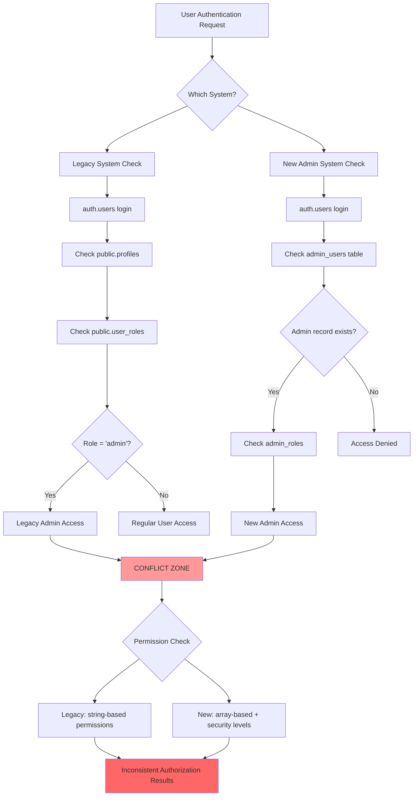

# Database Schema Conflicts Analysis

## Overview

This document details the specific schema conflicts and inconsistencies found in the authentication system. The analysis reveals multiple competing systems that create security vulnerabilities and operational complexity.

## Dual Authentication Systems Comparison

### System 1: Legacy Role-Based Authentication

**Tables:**
- [`auth.users`](../../supabase/migrations/20250528205000_create_profiles.sql) (Supabase managed)
- [`public.profiles`](../../supabase/migrations/20250528205000_create_profiles.sql:2-9) 
- [`public.roles`](../../supabase/migrations/20250528205100_create_roles_and_permissions.sql:4-9)
- [`public.permissions`](../../supabase/migrations/20250528205100_create_roles_and_permissions.sql:12-17)
- [`public.user_roles`](../../supabase/migrations/20250528205100_create_roles_and_permissions.sql:20-25)
- [`public.role_permissions`](../../supabase/migrations/20250528205100_create_roles_and_permissions.sql:27-32)

**Characteristics:**
- Simple string-based role names (`'admin'`, `'user'`)
- Basic permissions with string identifiers
- Junction table approach for many-to-many relationships
- Generic design suitable for regular users

### System 2: Advanced Admin Authentication

**Tables:**
- [`admin_roles`](../../supabase/migrations/20250531123000_admin_auth_schema.sql:6-14)
- [`admin_users`](../../supabase/migrations/20250531123000_admin_auth_schema.sql:16-24)
- [`admin_sessions`](../../supabase/migrations/20250531123000_admin_auth_schema.sql:26-34)

**Characteristics:**
- Hierarchical security levels (100, 90, 80)
- Array-based permissions (`permissions TEXT[]`)
- Route-based access control (`allowed_routes TEXT[]`)
- Session management with IP tracking
- Admin-specific design with enhanced security

## Detailed Schema Conflict Analysis



## Specific Conflicts Identified

### 1. Admin User Definition Conflicts

**Legacy System:**
```sql
-- From create_roles_and_permissions.sql
INSERT INTO public.roles (name, description) VALUES
    ('admin', 'Full system access');

-- Admin identified by role assignment
SELECT r.name FROM public.user_roles ur
JOIN public.roles r ON r.id = ur.role_id
WHERE ur.user_id = auth.uid() AND r.name = 'admin';
```

**New System:**
```sql
-- From admin_auth_schema.sql
CREATE TABLE admin_users (
  id UUID PRIMARY KEY REFERENCES auth.users(id),
  role_id UUID REFERENCES admin_roles(id),
  security_level INTEGER NOT NULL
);

-- Admin identified by dedicated table
SELECT security_level FROM admin_users 
WHERE id = auth.uid();
```

**Conflict:** A user could be an admin in one system but not the other, or have different permission levels.

### 2. Permission Model Conflicts

**Legacy Permissions:**
```sql
-- String-based permissions
INSERT INTO public.permissions (name, description) VALUES
    ('create:any_profile', 'Can create any user profile'),
    ('read:any_profile', 'Can read any user profile'),
    ('update:any_profile', 'Can update any user profile');
```

**New Admin Permissions:**
```sql
-- Array-based permissions with wildcard support
INSERT INTO admin_roles (name, level, permissions) VALUES
    ('SUPER_ADMIN', 100, ARRAY['*']),
    ('SYSTEM_ADMIN', 90, ARRAY['manage_admins', 'manage_systems']);
```

**Conflict:** Permission checking logic is completely different between systems.

### 3. RLS Policy Conflicts

**Legacy RLS Pattern:**
```sql
-- From create_rls_policies.sql lines 13-17
CREATE POLICY "Admin only insert access to roles"
    ON public.roles FOR insert
    WITH CHECK (
        EXISTS (
            SELECT 1 FROM public.user_roles ur
            INNER JOIN public.roles r ON r.id = ur.role_id
            WHERE ur.user_id = auth.uid()
            AND r.name = 'admin'
        )
    );
```

**New Admin RLS Pattern:**
```sql
-- From admin_auth_schema.sql lines 63-73
CREATE POLICY "Super admins can manage roles"
  ON admin_roles FOR ALL TO authenticated
  USING (
    EXISTS (
      SELECT 1 FROM admin_users au 
      WHERE au.id = auth.uid() 
      AND au.security_level >= 100
    )
  );
```

**Conflict:** RLS policies use different authorization checks, potentially creating security gaps.

### 4. Session Management Conflicts

**Legacy Approach:**
- Relies on Supabase built-in session management
- No custom session tracking
- Limited admin-specific controls

**New Admin Approach:**
```sql
-- Custom session management
CREATE TABLE admin_sessions (
  id UUID PRIMARY KEY DEFAULT uuid_generate_v4(),
  admin_id UUID REFERENCES admin_users(id),
  ip_address TEXT NOT NULL,
  user_agent TEXT NOT NULL,
  expires_at TIMESTAMPTZ NOT NULL
);
```

**Conflict:** Two different session management approaches with no integration.

## Data Integrity Issues

### 1. Orphaned Admin Records

```sql
-- Potential scenario: User exists in auth.users and legacy system
-- but not in new admin system
SELECT u.email, p.full_name, r.name as role
FROM auth.users u
JOIN public.profiles p ON p.id = u.id
JOIN public.user_roles ur ON ur.user_id = u.id
JOIN public.roles r ON r.id = ur.role_id
WHERE r.name = 'admin'
  AND NOT EXISTS (
    SELECT 1 FROM admin_users au WHERE au.id = u.id
  );
```

### 2. Conflicting Admin Permissions

```sql
-- User could have different admin levels in each system
SELECT 
  u.email,
  r.name as legacy_role,
  ar.name as new_admin_role,
  ar.level as security_level
FROM auth.users u
LEFT JOIN public.profiles p ON p.id = u.id
LEFT JOIN public.user_roles ur ON ur.user_id = u.id  
LEFT JOIN public.roles r ON r.id = ur.role_id
LEFT JOIN admin_users au ON au.id = u.id
LEFT JOIN admin_roles ar ON ar.id = au.role_id
WHERE r.name = 'admin' OR au.id IS NOT NULL;
```

## Impact Assessment

### Security Risks
1. **Authorization Bypass**: Users might gain admin access through one system while being blocked by another
2. **Privilege Escalation**: Inconsistent permission models could allow unintended access elevation
3. **Session Hijacking**: Dual session systems increase attack surface

### Operational Risks
1. **Inconsistent User Experience**: Admin users might see different interfaces/capabilities
2. **Data Corruption**: Conflicting writes from different systems
3. **Audit Trail Gaps**: Actions might be logged in one system but not another

### Development Risks
1. **Code Complexity**: Developers must handle two different auth patterns
2. **Testing Complexity**: Authentication tests must cover both systems
3. **Maintenance Burden**: Updates must be synchronized across systems

## Recommended Resolution Strategy

### Phase 1: Immediate Stabilization
1. **Disable One System**: Temporarily disable the conflicting system
2. **Data Audit**: Identify all affected users and their current permissions
3. **Emergency Fixes**: Patch critical security vulnerabilities

### Phase 2: Migration Planning
1. **Choose Target System**: Decide which authentication model to keep
2. **Data Migration**: Plan migration of users, roles, and permissions
3. **API Compatibility**: Ensure existing code continues to work

### Phase 3: Implementation
1. **Gradual Migration**: Move users in batches with rollback capability
2. **Code Updates**: Update all authentication checks to use single system
3. **Testing**: Comprehensive testing of all auth flows

### Phase 4: Cleanup
1. **Remove Legacy Code**: Delete unused tables and policies
2. **Documentation**: Update all auth documentation
3. **Monitoring**: Implement monitoring for auth issues

## Technical Debt Analysis

**Current Technical Debt:**
- **High Complexity**: Two authentication systems to maintain
- **Security Risks**: Multiple attack vectors due to inconsistencies  
- **Performance Impact**: Duplicate permission checks
- **Code Duplication**: Similar functionality implemented twice

**Resolution Benefits:**
- **Simplified Codebase**: Single authentication flow
- **Enhanced Security**: Consistent permission model
- **Better Performance**: Streamlined permission checks
- **Easier Maintenance**: Single system to update and monitor

---

**Document Status**: Critical Issues Identified  
**Next Action**: Review with security team and choose consolidation approach  
**Priority**: P0 - Immediate attention required